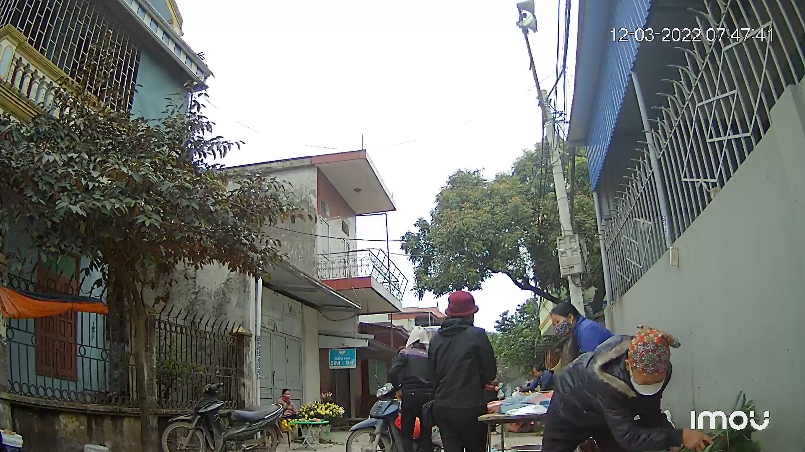
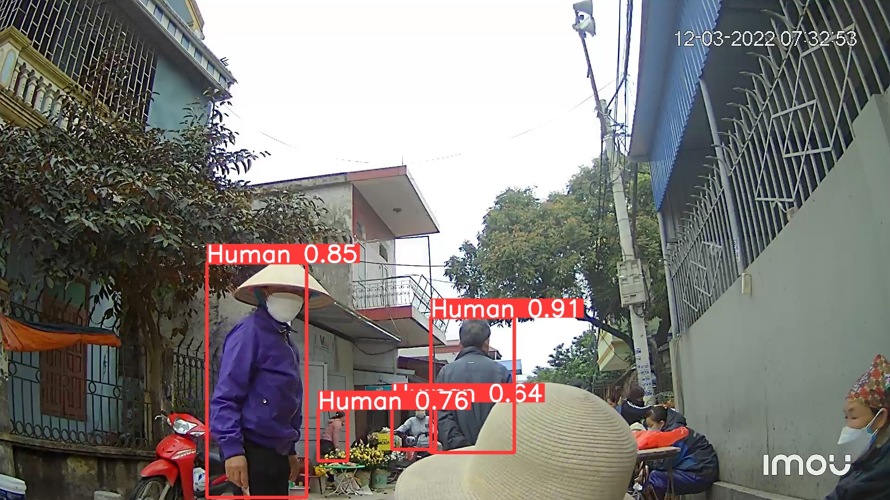
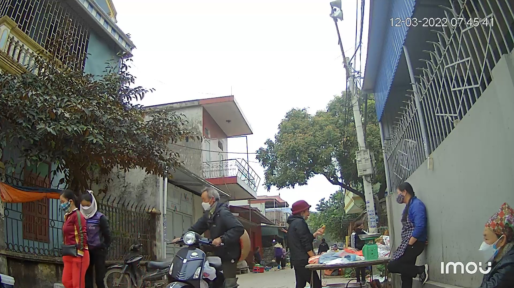

# Human Dectection using YOLOv8

## Introduction
- Object detection is a part Computer Vision that deals with detecting instances of semantic objects of a certain class (such as humans, buildings, or cars) in digital images and videos. In this project, I will use YOLOv8 to detect humans that are in a picture

## Results

Original Image        |  Output
:-------------------------:|:-------------------------:
 |  .jpg>)
.jpg)| 
|.jpg)

## Author
- Sang Nguyen